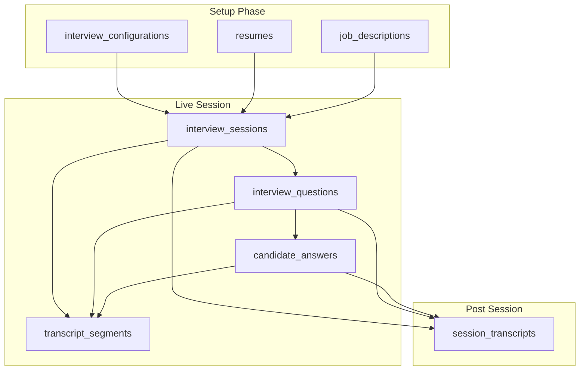
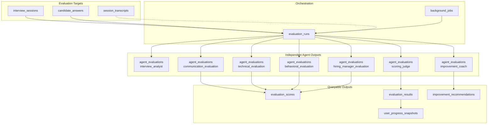
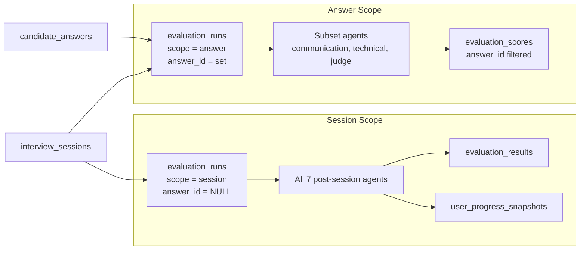
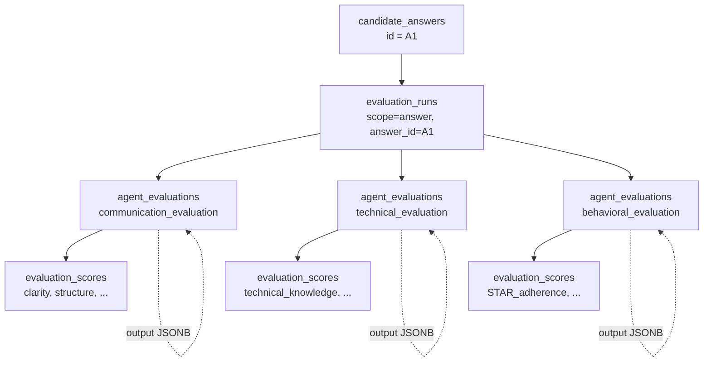
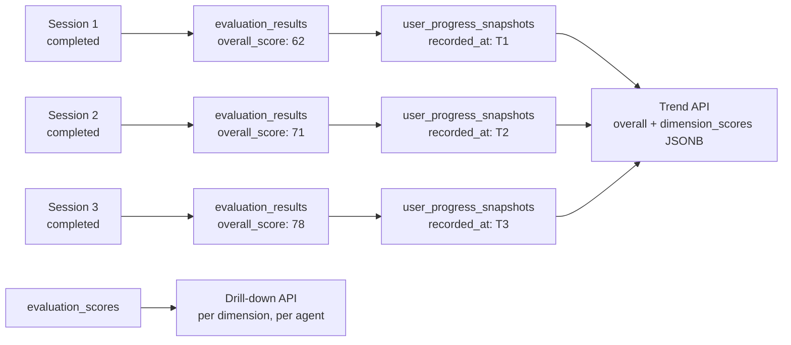

# Database ER Diagram — MVP

**Status:** Design (not yet implemented)  
**See also:** [database.md](./database.md)

---

## Full Entity Relationship Diagram

```mermaid
erDiagram
    users ||--o| user_profiles : has
    users ||--o{ refresh_tokens : has
    users ||--o{ resumes : owns
    users ||--o{ job_descriptions : owns
    users ||--o{ interview_configurations : creates
    users ||--o{ interview_sessions : conducts
    users ||--o{ user_progress_snapshots : tracks

    interview_configurations ||--o{ interview_sessions : templates
    resumes ||--o{ interview_sessions : provides_context
    job_descriptions ||--o{ interview_sessions : targets

    interview_sessions ||--o{ interview_questions : contains
    interview_sessions ||--o{ candidate_answers : contains
    interview_sessions ||--o{ transcript_segments : records
    interview_sessions ||--o| session_transcripts : assembles
    interview_sessions ||--o{ evaluation_runs : evaluated_by

    interview_questions ||--o| candidate_answers : answered_by
    interview_questions ||--o{ interview_questions : follow_up_to
    interview_questions ||--o{ transcript_segments : linked

    candidate_answers ||--o{ transcript_segments : linked
    candidate_answers ||--o{ evaluation_runs : answer_scope_eval

    evaluation_runs ||--o{ agent_evaluations : produces
    evaluation_runs ||--o| evaluation_results : rollups_to
    evaluation_runs ||--o{ improvement_recommendations : coaches
    evaluation_runs ||--o{ user_progress_snapshots : snapshots

    agent_evaluations ||--o{ evaluation_scores : extracts

    users {
        uuid id PK
        varchar email UK
        varchar password_hash
        boolean is_active
        timestamptz created_at
        timestamptz updated_at
    }

    user_profiles {
        uuid id PK
        uuid user_id FK UK
        varchar display_name
        varchar target_role
        jsonb preferences
        timestamptz created_at
        timestamptz updated_at
    }

    resumes {
        uuid id PK
        uuid user_id FK
        varchar title
        text raw_text
        text summary_text
        jsonb parsed_profile
        document_parse_status parse_status
        timestamptz created_at
        timestamptz updated_at
    }

    job_descriptions {
        uuid id PK
        uuid user_id FK
        varchar title
        varchar company_name
        text raw_text
        text summary_text
        jsonb parsed_requirements
        document_parse_status parse_status
        timestamptz created_at
        timestamptz updated_at
    }

    interview_configurations {
        uuid id PK
        uuid user_id FK
        varchar name
        interview_type interview_type
        integer target_duration_minutes
        jsonb settings
        timestamptz created_at
        timestamptz updated_at
    }

    interview_sessions {
        uuid id PK
        uuid user_id FK
        uuid configuration_id FK
        uuid resume_id FK
        uuid job_description_id FK
        interview_session_status status
        interview_type interview_type
        jsonb config_snapshot
        integer question_count
        timestamptz started_at
        timestamptz ended_at
        timestamptz created_at
        timestamptz updated_at
    }

    interview_questions {
        uuid id PK
        uuid session_id FK
        uuid parent_question_id FK
        integer sequence_num
        text question_text
        varchar topic_tag
        jsonb agent_metadata
        timestamptz asked_at
        timestamptz created_at
    }

    candidate_answers {
        uuid id PK
        uuid session_id FK
        uuid question_id FK UK
        text answer_text
        integer duration_ms
        numeric stt_confidence
        timestamptz answered_at
        timestamptz created_at
        timestamptz updated_at
    }

    transcript_segments {
        uuid id PK
        uuid session_id FK
        uuid question_id FK
        uuid answer_id FK
        speaker_role speaker
        integer sequence_num
        text text
        boolean is_final
        timestamptz created_at
    }

    session_transcripts {
        uuid id PK
        uuid session_id FK UK
        text full_text
        jsonb structured_transcript
        integer word_count
        timestamptz generated_at
        timestamptz created_at
    }

    evaluation_runs {
        uuid id PK
        uuid session_id FK
        uuid answer_id FK
        evaluation_scope scope
        evaluation_run_status status
        varchar trigger
        timestamptz started_at
        timestamptz completed_at
        timestamptz created_at
        timestamptz updated_at
    }

    agent_evaluations {
        uuid id PK
        uuid evaluation_run_id FK
        agent_name agent_name
        varchar schema_version
        boolean skipped
        text summary
        jsonb output
        jsonb token_usage
        timestamptz created_at
    }

    evaluation_scores {
        uuid id PK
        uuid agent_evaluation_id FK
        uuid evaluation_run_id FK
        uuid session_id FK
        uuid answer_id FK
        agent_name agent_name
        varchar dimension_key
        numeric score
        numeric max_score
        numeric normalized_score
        jsonb evidence
        timestamptz created_at
    }

    evaluation_results {
        uuid id PK
        uuid evaluation_run_id FK UK
        uuid session_id FK
        uuid answer_id FK
        numeric overall_score
        hire_recommendation hire_recommendation
        numeric confidence
        jsonb dimension_scores
        jsonb key_strengths
        jsonb key_gaps
        timestamptz created_at
    }

    improvement_recommendations {
        uuid id PK
        uuid evaluation_run_id FK
        uuid session_id FK
        uuid answer_id FK
        integer priority
        varchar area
        text recommendation_text
        jsonb action_items
        boolean is_acknowledged
        timestamptz created_at
        timestamptz updated_at
    }

    user_progress_snapshots {
        uuid id PK
        uuid user_id FK
        uuid session_id FK
        uuid evaluation_run_id FK
        interview_type interview_type
        numeric overall_score
        jsonb dimension_scores
        integer sessions_completed_count
        timestamptz recorded_at
        timestamptz created_at
    }

    background_jobs {
        uuid id PK
        varchar job_type
        jsonb payload
        varchar status
        integer attempts
        timestamptz run_after
        timestamptz created_at
        timestamptz updated_at
    }
```

---

## Interview Session Domain

How a live interview is structured from configuration through Q&A to transcript assembly.



---

## Evaluation Domain

How multi-agent evaluation supports both session-level and answer-level scope.



---

## Session vs Answer Evaluation Scope



**MVP launch:** Session scope is primary. Answer scope is schema-ready for future per-answer feedback without migration.

---

## Multi-Agent Independence (Same Answer)

Three agents evaluating the same candidate answer each get their own row — no shared mutable state.



**Unique constraint:** `(evaluation_run_id, agent_name)` ensures idempotent writes and no agent overwrites another.

---

## User Progress Over Time



---

## Table Groups by Domain

| Domain | Tables |
|--------|--------|
| **Identity** | `users`, `user_profiles`, `refresh_tokens` |
| **Context** | `resumes`, `job_descriptions` |
| **Interview** | `interview_configurations`, `interview_sessions`, `interview_questions`, `candidate_answers` |
| **Transcripts** | `transcript_segments`, `session_transcripts` |
| **Evaluation** | `evaluation_runs`, `agent_evaluations`, `evaluation_scores`, `evaluation_results`, `improvement_recommendations` |
| **Progress** | `user_progress_snapshots` |
| **Infrastructure** | `background_jobs` |

---

## Cardinality Reference

| Relationship | Cardinality |
|--------------|-------------|
| users → user_profiles | 1 : 0..1 |
| users → interview_sessions | 1 : N |
| interview_sessions → interview_questions | 1 : N |
| interview_questions → candidate_answers | 1 : 0..1 |
| interview_sessions → session_transcripts | 1 : 0..1 |
| interview_sessions → evaluation_runs | 1 : N |
| candidate_answers → evaluation_runs (answer scope) | 1 : N |
| evaluation_runs → agent_evaluations | 1 : N (up to 7 agents) |
| agent_evaluations → evaluation_scores | 1 : N |
| evaluation_runs → evaluation_results | 1 : 0..1 |
| evaluation_runs → improvement_recommendations | 1 : N |
| completed session eval → user_progress_snapshots | 1 : 1 |
